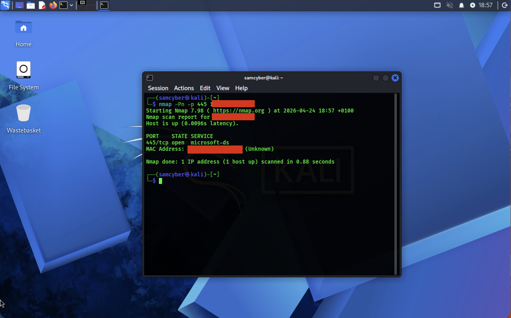
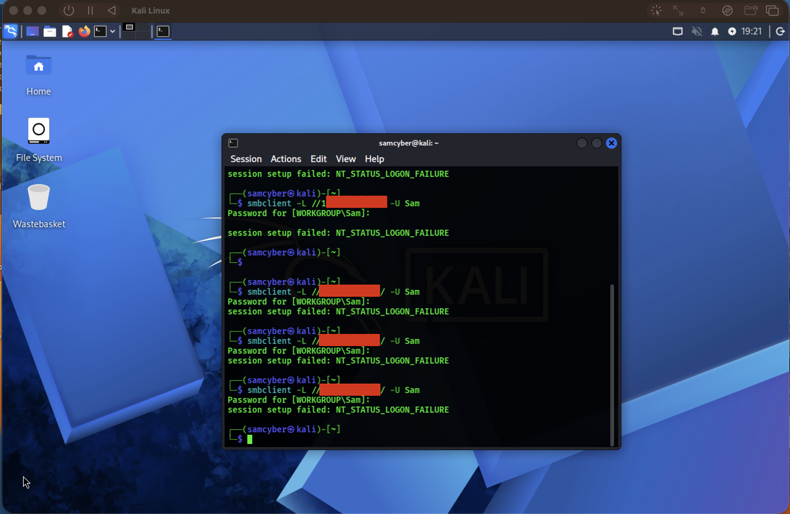
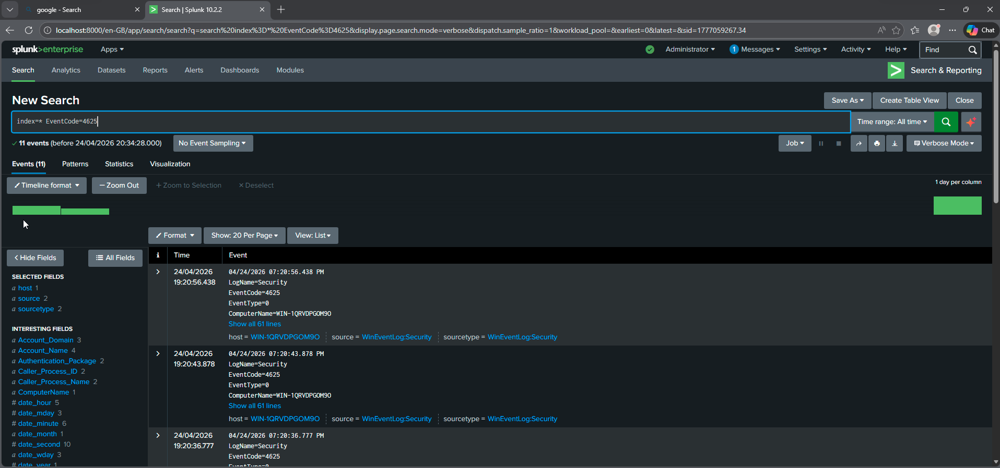
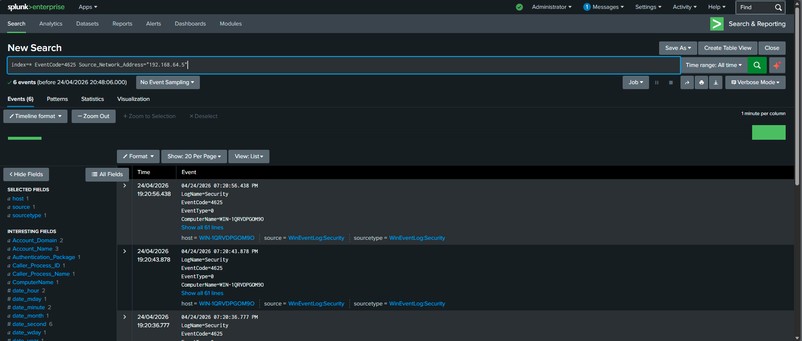

# Scenario 1: Brute Force Authentication Detection

## Overview

This scenario simulates a brute force authentication attack against a Windows endpoint from a remote Kali Linux machine. The objective was to generate repeated failed login attempts and analyse the resulting security logs using Splunk to identify malicious behaviour patterns.

The investigation focuses on detecting failed authentication activity, identifying the source of the attack, and assessing whether any successful compromise occurred.

---

## Attack Simulation

A brute force login attempt was simulated from a Kali Linux VM targeting a Windows 11 VM.

The attack involved repeated authentication attempts against a local Windows user account using incorrect credentials over SMB.

This activity generated multiple failed logon events on the Windows system.

---

## Detection Method

Detection was performed using **Splunk Enterprise** by analysing Windows Security Event Logs.

The primary event type used for detection was:

- **Event ID 4625 – Failed Logon Attempt**

---

## Findings

The investigation identified the following:
- Multiple failed login attempts were recorded in a short time period
- All failed authentication attempts originated from a single source IP (Kali Linux VM)
- The same user account was repeatedly targeted
- The frequency of attempts indicates automated or scripted behaviour consistent with brute force activity
- No successful logon events (Event ID 4624) were observed following the failed attempts

---

## Evidence

### Figure 1 — Reconnaissance Activity from Kali Linux VM

This screenshot shows nmap scan to detect for open ports within the Windows VM.

---

### Figure 2 — Brute Force Attempts

This screenshot shows multiple brute force authentication attempts originating from the Kali Linux VM targeting the Windows system. 
These repeated login attempts are consistent with automated credential guessing behaviour.

---

### Figure 3 — Failed Logon Events (Event ID 4625)

Splunk detection of multiple failed authentication attempts. Event ID 4625 indicates unsuccessful login attempts. 
Events sorted by time to identify burst activity and detect unusual login patterns.

---

### Figure 4 — Pivot Analysis on Source IP Address

Filtered Splunk results showing all activity from the suspicious Kali Linux IP address.

---

## Evidence Summary
The following evidence supports the conclusion of a brute force authentication attempt:
- Event Type: 4625 (Failed Logon)
- Source IP: Kali Linux VM
- Target Account: Sam
- Pattern: Repeated authentication failures over a short time window
- Behaviour: High-frequency login attempts from a single source
- Outcome: No successful authentication detected

---

## Security Assessment
The observed activity is consistent with a brute force authentication attack targeting a Windows endpoint.
The repeated failed login attempts suggest an attempt to guess valid credentials through trial-and-error.
No evidence of successful compromise was identified during the investigation.

---

## MITRE ATT&CK Mapping
This activity maps to the following technique:
- T1110 – Brute Force

Reference: https://attack.mitre.org/techniques/T1110/

---

## Conclusion
This scenario demonstrates the detection and investigation of brute force authentication attempts using Windows event logs and Splunk.

The investigation successfully identified:
- The source of the attack (Kali Linux VM)
- The targeted account
- The repeated failed authentication pattern
- The absence of successful logins
- The attack behaviour consistent with brute force techniques
- This highlights the importance of monitoring failed authentication events as an early indicator of credential-based attacks.

---

## Recommendations
To improve security posture and mitigate similar attacks, the following measures are recommended:
- Implement account lockout policies after repeated failed login attempts
- Enforce multi-factor authentication (MFA) for privileged accounts
- Monitor and alert on spikes in Event ID 4625 activity
- Restrict or secure SMB and remote authentication services
- Implement IP-based rate limiting or blocking for repeated failures
- Use SIEM correlation rules to detect brute force patterns in real time

