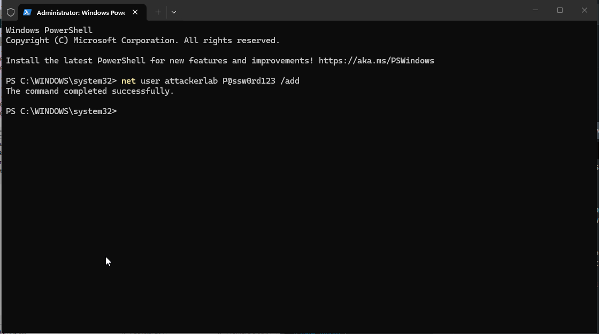
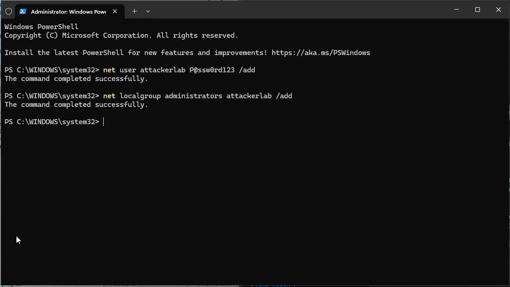
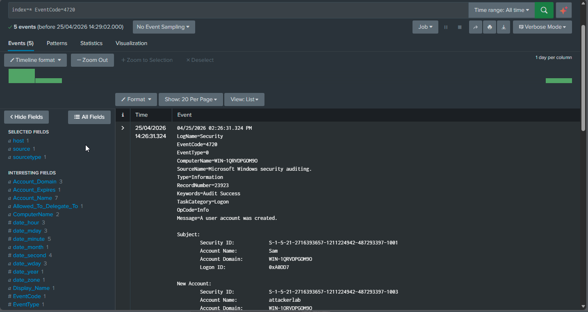
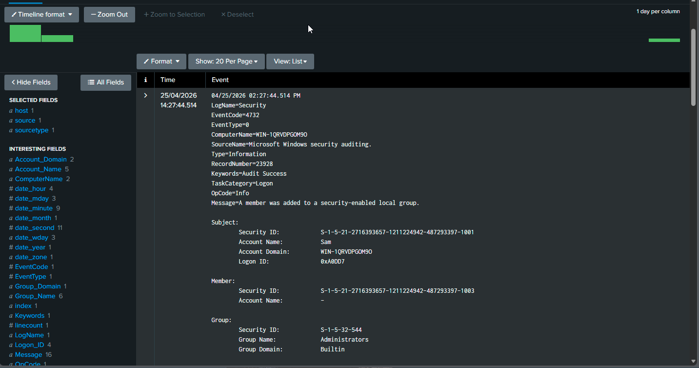
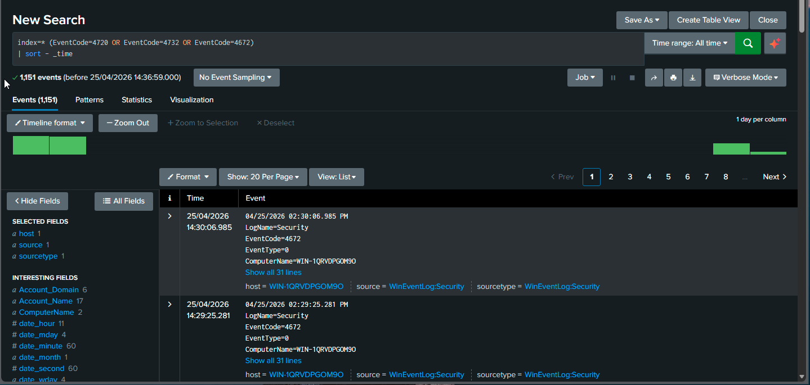

# Scenario 2: Privilege Escalation via Local Account Creation

## Overview

This scenario simulates a Windows privilege escalation attack using PowerShell scripts to create a local user and elevate it to Administrator level. The activity is then analysed in Splunk using Windows Event Logs to detect and reconstruct the full attack chain from account creation to privilege escalation.

---

## Findings

The investigation identified a sequence of security events indicating successful privilege escalation on the Windows endpoint.

Analysis of Windows Security Event Logs within Splunk revealed the following chain of activity:

1. A new local user account `attackerlab` was created (Event ID 4720)
2. The account was subsequently added to the local Administrators group (Event ID 4732)
3. A logon session with elevated privileges was detected (Event ID 4672)

These events occurred in a short timeframe and were all associated with the same user account, indicating a coordinated attempt to escalate privileges following initial access.

---

## Evidence

### Figure 1 — PowerShell User Creation

This screenshot shows a PowerShell command executed to create a new local user account named `attackerlab`.

---

### Figure 2 — Privilege Escalation via Administrators Group

This shows a PowerShell command adding the `attackerlab` user to the local Administrators group, granting elevated privileges.

---

### Figure 3 — Splunk Event ID 4720 (User Creation)

This Splunk event confirms the creation of the new local user account `attackerlab`.

---

### Figure 4 — Splunk Event ID 4732 (Group Membership Change)

This event shows the `attackerlab` user being added to the Administrators group.

---

### Figure 5 — Full Privilege Escalation Timeline

This view correlates Event IDs 4720, 4732, and 4672, reconstructing the full privilege escalation chain.

---

## Security Impact

This activity represents a high-severity security event, as the attacker successfully elevated privileges from a standard user to an administrative level. This level of access would allow:
- Full system control
- Persistence mechanisms (backdoors, scheduled tasks)
- Credential harvesting
- Potential lateral movement within a network

---

## Analyst Interpretation

The behaviour is consistent with post-compromise attacker activity, where privilege escalation is used to maintain control over the system and bypass access restrictions.

---

## MITRE ATT&CK Mapping

This scenario aligns with the following techniques from the MITRE ATT&CK framework:

- T1136.001 — Create Account: Local Account (user creation via net user)
- T1098 — Account Manipulation (adding user to Administrators group)
- T1068 — Exploitation for Privilege Escalation (gaining elevated privileges)

These techniques demonstrate common post-compromise behaviours used by attackers to maintain persistence and increase control over a system.

---

## Executive Summary

This investigation analysed Windows Security Event Logs within Splunk to detect and reconstruct a privilege escalation attempt on the target system.

The analysis identified the creation of a new local user account, followed by its addition to the local Administrators group, resulting in elevated system privileges.

---

## Conclusion

This investigation successfully demonstrated how Windows Event Logs can be used to detect and reconstruct privilege escalation activity.

By correlating Event IDs 4720, 4732, and 4672 within Splunk, the full attack chain was identified, from account creation to administrative access.

This highlights the importance of monitoring authentication events and group membership changes as part of a defensive security strategy.

---
